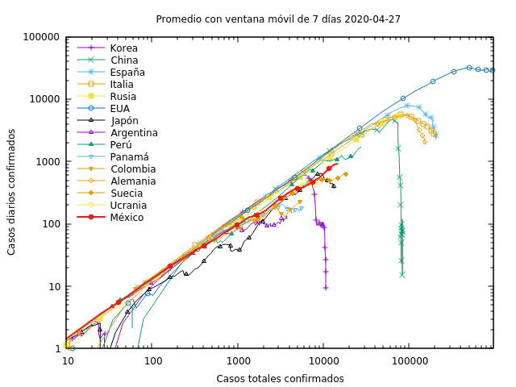
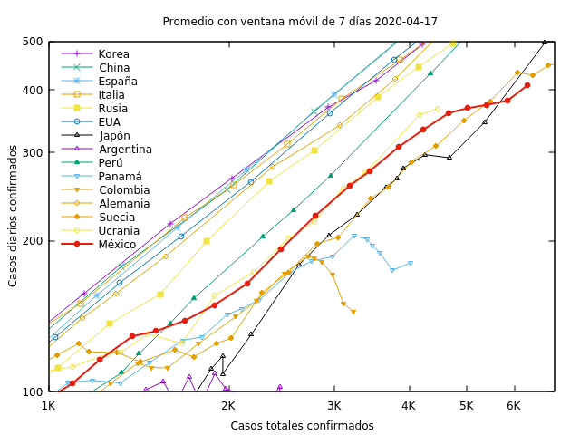
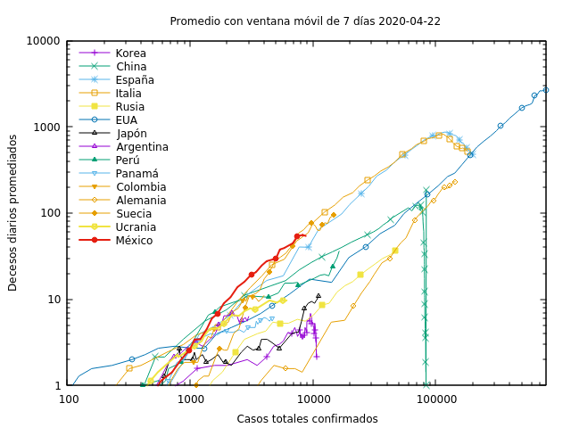
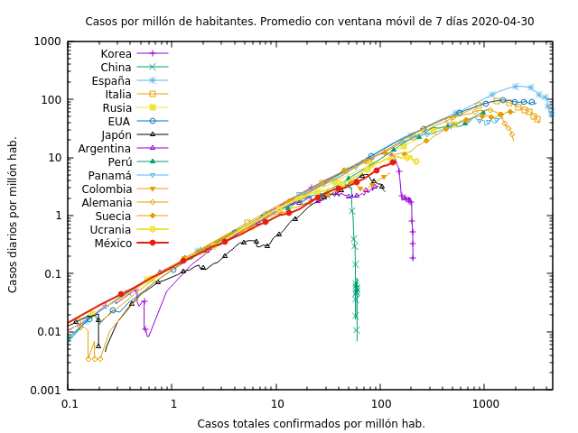
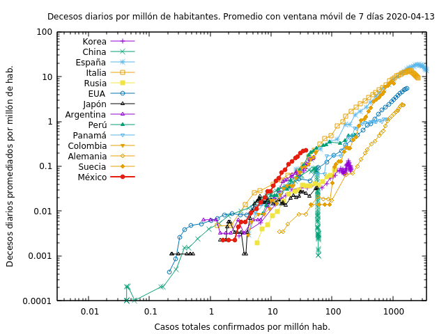
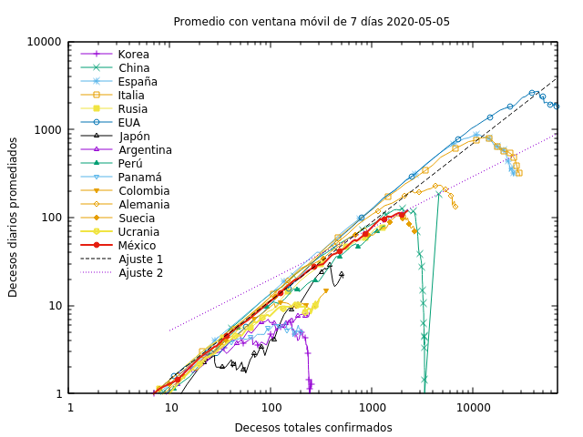
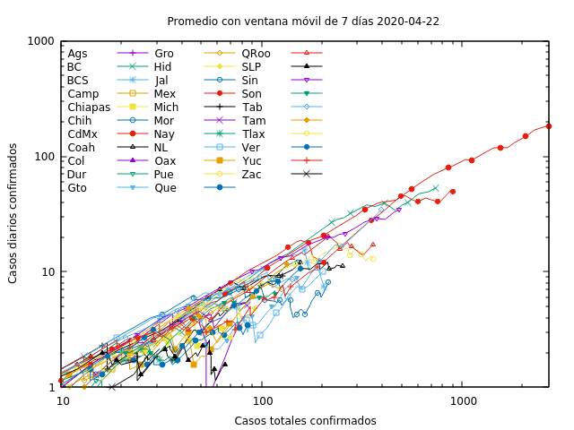
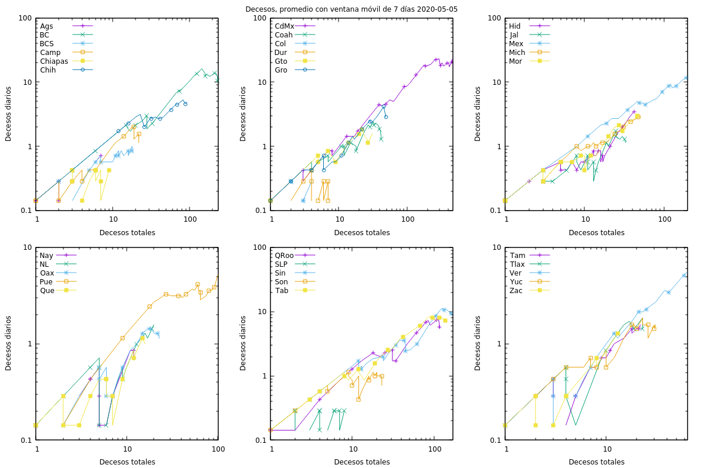
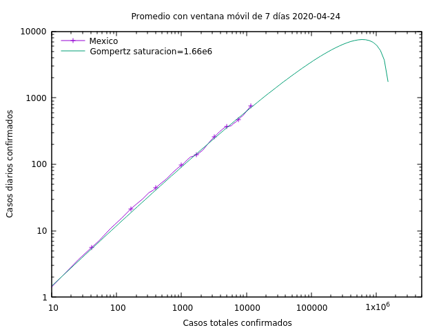

# COVID

Programs to visualize data on covid-19

It includes the following

* extractCases.pl

  Program to download (if necessary) a *European CDC* database listing
  the worldwide distribution  of covid-19 cases and deceases, choose
  some countries and prepare some files for easy plotting of the
  results.

  To run the program you need a perl compiler/interpreter and the
  perl packages Spreadsheet::Read, Spreadsheet::XLSX, Getopt::Long and
  List::Util. You might also need the programs wget, libreoffice and gnuplot.

  Run it without arguments or with the argument --help to get
  instruccions: `perl extractCases.pl --help`.

  The result is a list of files that can be fed to gnuplot for
  plotting

* extractMX.pl

  Program to extract the cases for different regions of México from
  clones of the github repository
  [DataScienceResearchPeru/covid-19_latinoamerica](https://github.com/DataScienceResearchPeru/covid-19_latinoamerica)

  To run the program you need a perl compiler/interpreter and the
  perl package Getopt::Long.

  Run it without arguments or with the argument --help to get
  instruccions: `perl extractMX.pl --help`.

  The result is sent to STDOUT but it may be redirected to a file that
  may be fed to gnuplot for plotting.

* mortandad.pl

  Program to extract data from an INEGI database on monthly deceases
  and prepare a file for gnuplot. Requires the package
  Text::CSV_XS. Before running it you must configure the path to the
  csv database. The program not polished and is not robust. I was
  happy it did work once.

* plotcases.g, plotdec.g, plotcasesN.g, plotdecN.g, plotcasesMX...

  Gnuplot commands that may be loaded by the gnuplot program to plot
  the number of new cases and new deseased as a function of the total
  number of cases. `load 'plotcases.g'` and `load 'plotdec.g'`. May
  need editing according to your choice of countries and the
  positioning of labels and arrows. The names with an *N* plot the
  same information, but normalized to the total population of the
  country. The names with an *MX* are for the regions of Mexico.

* mx.txt, us.txt, cn.txt...

  Extracted data files for some countries. They consist of space
  separated columns (appropriate for using as gnuplot's input) with
  1- the accumulated number of confirmed cases
  2- the daily number of confirmed cases
  3- daily number of deceased
  4- the daily number of confirmed cases divided by population
  5- daily number of deceased divided by population
  6- the total population (2018)
  7- the total number of deceased

* estados.txt

  Extracted data for the states of Mexico. They consist of newline
  separated blocks of data, one for each state, preceeded by the name
  of the state and followed by space separated columns (apprropirate
  for using as gnuplot's input).
  1- the accumulated number of confirmed cases
  2- the averaged daily number of confirmed cases
  3- the accumulated number of deceases
  4- the daily number of deceases

* mortandad2018.txt

  Total monthly deceases vs. date, extracted from INEGI's
  databases. It consists of two space separated columns of the form
  1. Date (YYYY-MM)
  2. Total monthly deceases.

* cases.png

  plot: daily cases vs. total cases

  

* detail.png

  detail of cases.png

  

* dec.png

  plot: daily deceased vs. total cases.

  

* casesN.png

  plot: daily cases vs. total cases normalized to population

  

* decN.png

  plot: daily deceased vs. total cases normalized to population

  

* decvsdec.png

  plot: daily deceased vs. total deceased.

  

* casesMX.png

  plot: daily cases vs. total cases for regions of Mexico

  

* decMX.png

  plot: daily deceased vs. total deceased of México

  

* decesosMensuales.png

  plot: Historical monthly total deceases in México vs. date

  

* gompertz.png

  Averaged daily cases vs. total cases and extrapolation using
  fitted Gompertz formula, as of 2020-04-24.

  

## Author

   - W. Luis Mochán  `mochan@fis.unam.mx`

## Licence

This software is copyright (c) 2020 by W. Luis Mochán.

This is free software; you can redistribute it and/or modify it under
the same terms as the Perl 5 programming language system itself.

## Acknowledgment

This work was partially supported by DGAPA-UNAM under grant IN111119.
