# COVID

Programs to visualize data on covid-19, and some results.

It includes the following in directory *files*

* all.pl

  Script to run all the required programs and plot information related
  to covid-19 in the world with emphasis in Mexico.

  To run you require a PERL compiler/interpreter and the packages
  Getopt::Long and List::Util, besides satisfying the requisites of
  the other programs.

  Run it without arguments or with the argument --help to get
  (criptic) instructions: perl all.pl --help

* extractCases.pl

  Program to download (if necessary) a *European CDC* database listing
  the worldwide distribution  of covid-19 cases and deceases, choose
  some countries and prepare some files for easy plotting of the
  results.

  To run the program you need a perl compiler/interpreter and the
  perl packages Spreadsheet::Read, Spreadsheet::XLSX, Getopt::Long and
  List::Util. You might also need the programs wget, libreoffice and gnuplot.

  Run it without arguments or with the argument --help to get
  instruccions: `perl extractCases.pl --help`.

  The result is a list of files that can be fed to gnuplot for
  plotting

* extractMX.pl

  Program to extract the cases for different regions of México from
  clones of the github repository
  [DataScienceResearchPeru/covid-19_latinoamerica](https://github.com/DataScienceResearchPeru/covid-19_latinoamerica)

  To run the program you need a perl compiler/interpreter and the
  perl package Getopt::Long.

  Run it without arguments or with the argument --help to get
  instruccions: `perl extractMX.pl --help`.

  The result is sent to STDOUT but it may be redirected to a file that
  may be fed to gnuplot for plotting.

* mortandad.pl

  Program to extract data from an INEGI database on monthly deceases
  and prepare a file for gnuplot. Requires the package
  Text::CSV_XS. Before running it you must configure the path to the
  csv database. The program not polished and is not robust. I was
  happy it did work once.

* plotcases.g, plotdec.g, plotcasesN.g, plotdecN.g, plotcasesMX...

  Gnuplot scripts that may be loaded by the gnuplot program to plot
  the number of new cases and new deseased as a function of the total
  number of cases. `load 'plotcases.g'` and `load 'plotdec.g'`. May
  need editing according to your choice of countries and the
  positioning of labels and arrows. The names with an *N* plot the
  same information, but normalized to the total population of the
  country. The names with an *MX* are for the regions of Mexico.

* mx.txt, us.txt, cn.txt...

  Extracted data files for some countries. They consist of space
  separated columns (appropriate for using as gnuplot's input) with

  1- the accumulated number of confirmed cases
  2- the daily number of confirmed cases
  3- daily number of deceased
  4- the daily number of confirmed cases divided by population
  5- daily number of deceased divided by population
  6- the total population (2018)
  7- the total number of deceased
  8- the estimate of sick people
  9- total cases averaged
  10- total deaths averaged

  The order is an historical accident.

* states.txt

  Extracted data for the states of Mexico. They consist of newline
  separated blocks of data, one for each state, preceeded by the name
  of the state and followed by space separated columns (apprropirate
  for using as gnuplot's input).
  1- the accumulated number of confirmed cases
  2- the averaged daily number of confirmed cases
  3- the accumulated number of deceases
  4- the daily number of deceases

* gompertzK.txt

  Data with the gompertz prediction for Mexico. The first column is the
  last number of daily record used to make the
  prediction. Substracting 62 gives the number of days since the first
  decease. The second column is the saturation parameter of the
  Gompertz extrapolation fitted up to the corresponding date, i.e.,
  the K in the formula K exp(-b exp(-a t))

* mortandad2018.txt

  Total monthly deceases vs. date, extracted from INEGI's
  databases. It consists of two space separated columns of the form
  1. Date (YYYY-MM)
  2. Total monthly deceases.

* cases.png

  Plot: Daily cases vs. total cases Rolling 7 day average.

  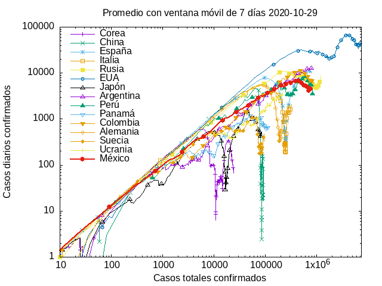

  Comment: 2020-07-16. The last three months have seen an almost
  straight line for Mexico with a slope of 0.61. The fitted slope has
  been decreasing, but with an extreme slowness. A straight line means
  a power law. As daily cases are a power of total cases, the total
  cases are a power of time, with exponent 1/(1-m). Currently this
  means the number of cases has an **accelerated growth,** as
  t^{5/2}. As with any power law, the relative growth (daily/total
  cases) does diminish, but this doesn't mean there is any kind of
  deceleration. Mexico is now above most countries in total number of
  cases. (See below for normalized plots and for extrapolations).

* detail.png

  Plot: Detail of cases.png

  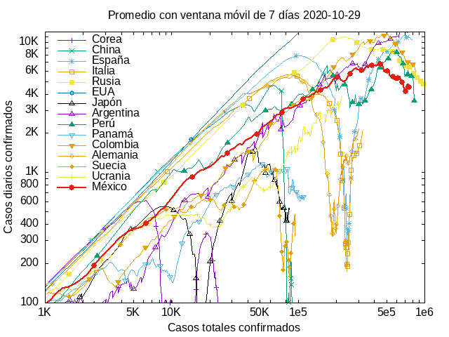

* dec.png

  Plot: Daily deceased vs. total cases.

  

  Comment: 2020-07-16. The behavior of this plot of daily deceases as
  a function of total cases is strange. It started as a straight line
  with a slope significantly larger than 1. This seems to mean that the
  initial growth was faster than exponential! It doesn't though, as
  the axes correspond to different quantities. Nevertheless, I would
  hve expected a result proportional to the number of daily cases,
  maybe with a delay, not a muh faster behavior. I don't know the
  reason. Seculating, maybe it shows that the health system improved
  in its identification capacity and the percentage of correctly
  identified causes of death increased with time, or maybe there was
  some advantage of stating that unrelated deaths were covid-19
  related (I read that there were benefits for families of covid-19
  deceased patients, and I was told long ago that hospitals asked
  permission of families to include covid-19 in unrelated death
  certificates for unknown reasons). Nevertheless, after a month, the
  slope evolved rapidly. Curiously, it is now smaller than the slope
  for new confirmed cases, and for the last month there seems to be an
  decrease in the number of covid-19 related deceases. I find it
  strange that the deceases diminish while the total cases
  accelerate. Again, I can only speculate. Maybe the hospitals are
  becoming better at dealing with covid-19, or there is some incentive
  to state other causes of death in the certificates. The pressure the
  government put on itself by their untimely and confusing
  announcement of the end of the pandemic and the return to (new)
  normal times may be distorting the reports; I don't know.

* casesN.png

  plot: daily cases vs. total cases normalized to population

  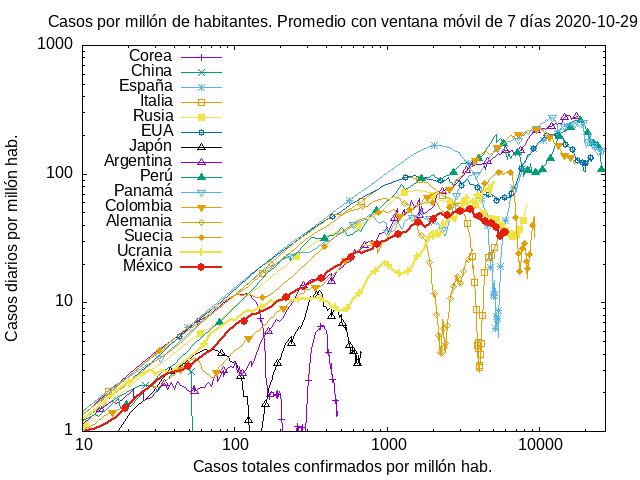

  Comment: 2020-07-16. The shape of these curves is the same as those
  of cases.png above. In the log scale, they are simply
  shifted. Mexico, being a relatively large country, doesn't seem as
  bad when the number of cases is normalized, though it doesn't look
  too good either.

* decN.png

  Plot: Daily deceased vs. total cases normalized to population

  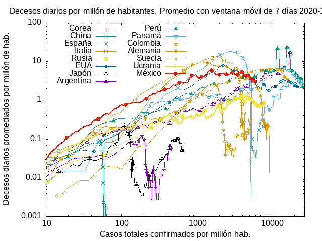

  Comment: 2020-07-16. Similar comments as to dec.png and casesN.png
  apply here.

* decvsdec.png

  Plot: Daily deceased vs. total deceased.

  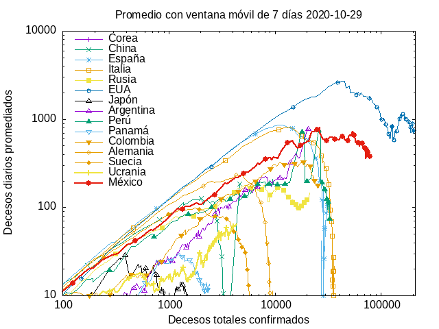

  Comment: 2020-07-16. Comments similar to those of dec.png apply,
  though, the initial slope here is below 1, which corresponds to a
  non-exponential, but accelerated power-law growth.

* sick.png

  Plot: Estimated currently sick people vs. total cases

  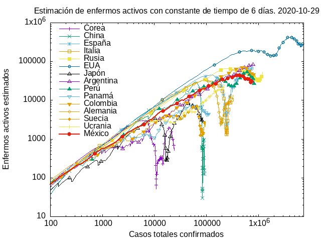

  Comment: 2020-07-17. This plot doesn't show the actual data, but
  rather, an estimate. I arbitrarily that the recovery (or death) is a
  probabilistic Poisson process with some given time scale tau. Thus,
  the number of active sick patients today is yesterday's number
  multiplied by their probability of not recovering (or dying), some fixed
  factor which I write as exp(1 day/tau), plus the newly arrived
  cases. I adjusted the time constant to the official data of
  2020-05-04 and found tau=6. I have heard that the recovery time is
  14 days but I don't know exactly how it is defined. Nevertheless,
  6.08=14/log(10), so tau=6 corresponds to 90% of all cases recovered
  after 14 days, which I seems a reasonable *definition* of the
  recovery time. The number of actively sick patients using this
  approach has remained close to the official numbers which I have
  checked occasionally. This plot is similar to that in cases.png
  above, but with a slightly larger slope. This could be understood as
  it contains memory of previous data, from when the slope for new cases
  was also higher.

* casesMX.png

  Plot: Daily cases vs. total cases for regions of Mexico

  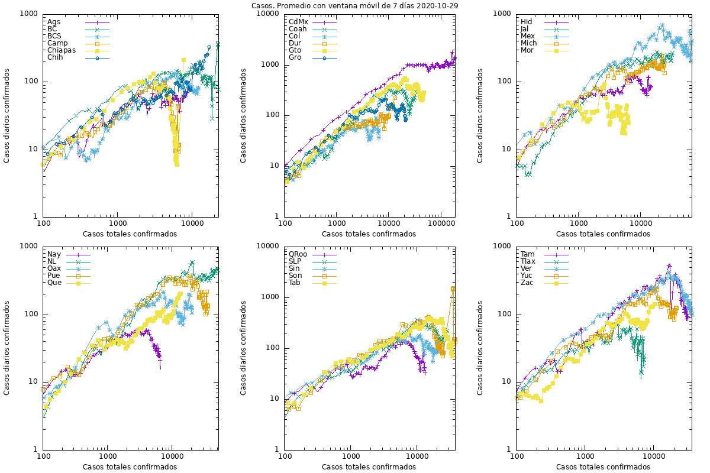

* decMX.png

  Plot: Daily deceased vs. total deceased of México

  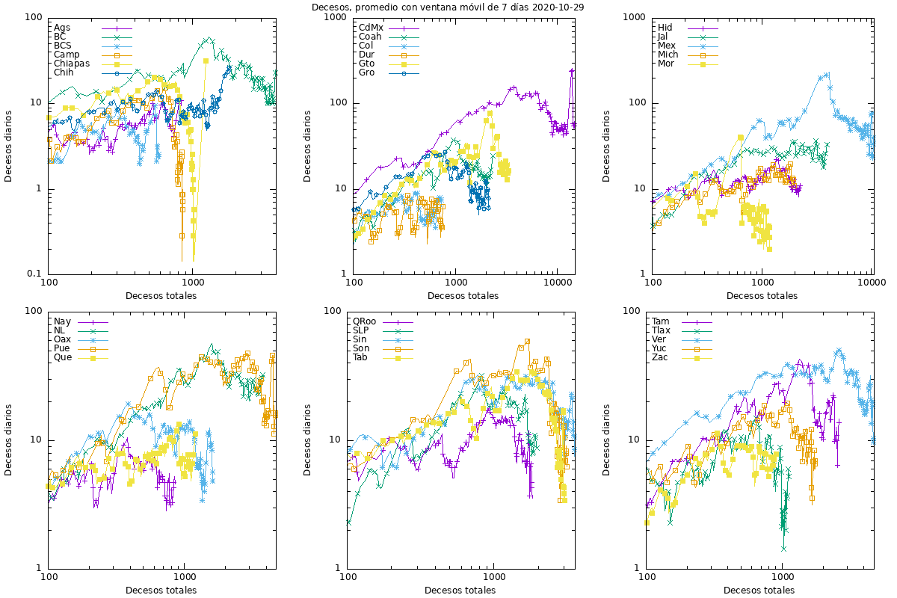

* decesosMensuales.png

  Plot: Historical monthly total deceases in México vs. date

  

* gompertz.png

  Plot: Daily cases vs. total cases for Mexico and extrapolation using
  fitted Gompertz formula. Not averaged

  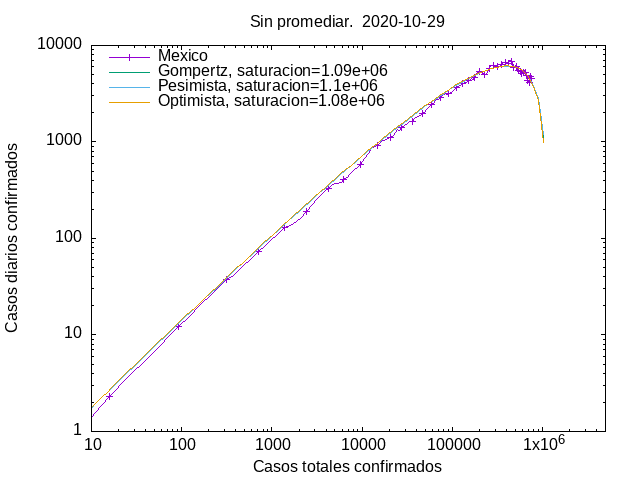

  Comment: 2020-07-17. Gompertz formula is a simple model which has
  been applied to study epidemics and many other systems with analogous
  dynamics. Instead of the differential equations of the SIR model and
  all its more or less sophisticated variants, it offers a simple
  formula C(t)=K exp(-b exp(-a t)), where C(t) is the number of
  accumulated total cases, and K, a and b are parameters to be
  fitted. As I'm plotting C' (daily cases) vs. C, I derive a simpler
  formula C'=a C log(K/C) which has only two parameters, making it
  slightly more robust. K is the maximum number of (confirmed) cases
  and is expected to reach values around 1,200,000. You might have to
  multiply by some factor  to convert confirmed cases to total cases
  (I've read estimations that go from 8 to 30 or up to 80).  The
  maximum corresponds to C=K/e (e=exp(1)) around 440,000, with a maximum value
  C'=aK/e around 6500. As the total number of cases is currently
  324000, we should expect slightly more than two weeks for the peak
  and around four months for the end.

* animateGompertz.gif

  Plot: Daily cases vs. total cases for Mexico and animation of the
  extrapolation for different days fitted Gompertz formula. Not averaged.

  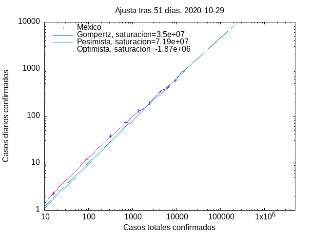

  Comment: 2020-07-17. See the comment for gompertz.png. This
  animation shows that the Gompertz extrapolation is not a good
  predictor during the initial phase of an epidemics, as there is only
  data on one of the tails of the distribution. This, a single new
  data point might strongly change the fit. Nevertheless, as more data
  is accumulated and we approach the peak, the fits somewhat
  stabilizes.

* gompertzK.png

  Plot: Estimated total number of cases as a function of the number of
  days since the first decease when the estimation was made.

  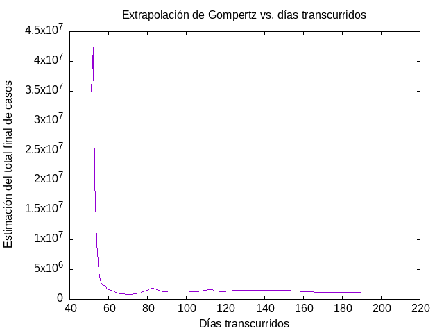

  Comment: 2020-07-17. The estimations were done using the Gompertz
  formulae (see gompertz.png
  above). The very early estimates vary wildly and are not
  shown. After 50 days the expected total number of cases seems to
  increase systematically but with some large fluctuations. Currently
  the estimate lies around 1.2 million cases.

* gompertzdec.png

  Daily deceased vs. total deceased for Mexico and extrapolation using
  fitted Gompertz formula. Not averaged.

  

## Author

   - W. Luis Mochán  `mochan@fis.unam.mx`

## Licence

This software is copyright (c) 2020 by W. Luis Mochán.

This is free software; you can redistribute it and/or modify it under
the same terms as the Perl 5 programming language system itself.

## Acknowledgment

This work was partially supported by DGAPA-UNAM under grant IN111119.
